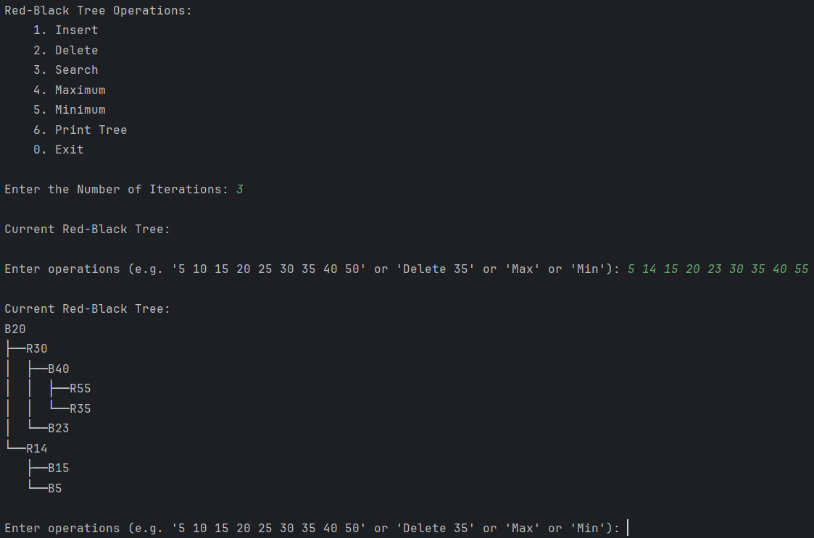
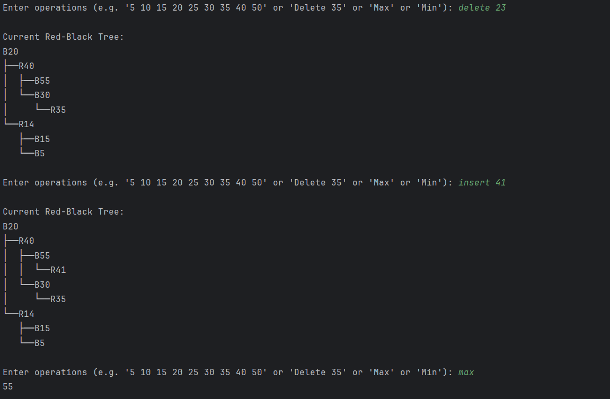

<h1 align="center">
   
  Red-Black Tree Implementation in Python
   
</h1>

<h4 align="center">This repository contains a Python implementation of a Red-Black Tree data structure, along with various operations such as insertion, deletion, searching, finding the maximum and minimum values, and printing the tree.</h4>

  
  
   

# Description

## Red-Black Tree

A Red-Black Tree is a type of self-balancing binary search tree. It maintains balance by ensuring that the following properties are satisfied:

1. Every node is either red or black.
2. The root is always black.
3. Red nodes have black children (no two red nodes can be adjacent).
4. Every path from a node to its descendant NIL nodes (leaves) contains the same number of black nodes.

## Code Explanation

### Node Class

- `Node`: Represents a node in the Red-Black Tree, containing a key, color (red or black), left child, right child, and parent.

### RedBlackTree Class

- `RedBlackTree`: Implements the Red-Black Tree data structure and its operations.

### Operations

- **Insertion**: Inserts a new key into the tree while maintaining the Red-Black Tree properties.
- **Deletion**: Removes a key from the tree while ensuring that the Red-Black Tree properties are preserved.
- **Search**: Searches for a key in the tree.
- **Maximum and Minimum**: Finds the maximum and minimum keys in the tree.
- **Print Tree**: Displays the Red-Black Tree structure.

## Usage

To use the Red-Black Tree implementation:

1. Instantiate a `RedBlackTree` object.
2. Perform operations such as insertion, deletion, searching, etc., using the provided methods.

